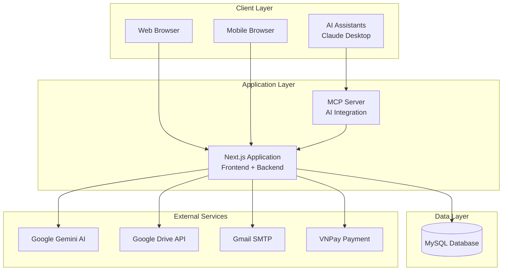

# ChatStoryAI

[](https://github.com/HuynhPhuocTho564/BaoCaoCNPM)
[](LICENSE)
[](https://nodejs.org/)
[](https://nextjs.org/)
[](https://www.typescriptlang.org/)

**Nền tảng sáng tạo truyện thông minh với AI tích hợp**

ChatStoryAI là một nền tảng full-stack hiện đại cho phép người dùng tạo, quản lý và chia sẻ truyện với sự hỗ trợ của trí tuệ nhân tạo. Được xây dựng trên kiến trúc monolithic với Next.js và tích hợp Model Context Protocol (MCP) để hỗ trợ AI assistants như Claude Desktop.

---

## 📋 Mục Lục

- [Tổng Quan](#-tổng-quan)
- [Kiến Trúc Hệ Thống](#-kiến-trúc-hệ-thống)
- [Tính Năng](#-tính-năng)
- [Công Nghệ](#-công-nghệ)
- [Cài Đặt](#-cài-đặt)
- [Cấu Hình](#-cấu-hình)
- [API Documentation](#-api-documentation)
- [MCP Integration](#-mcp-integration)
- [Phát Triển](#-phát-triển)
- [Triển Khai](#-triển-khai)
- [Bảo Mật](#-bảo-mật)
- [Đóng Góp](#-đóng-góp)
- [Hỗ Trợ](#-hỗ-trợ)

---

## 🎯 Tổng Quan

### Mô Tả Sản Phẩm

ChatStoryAI là một nền tảng sáng tạo nội dung thông minh, kết hợp sức mạnh của AI để hỗ trợ người dùng trong việc:

- **Sáng tạo truyện**: Tạo ý tưởng, phát triển cốt truyện và nhân vật với AI
- **Quản lý nội dung**: Tổ chức chương, theo dõi tiến độ và xuất bản
- **Cộng đồng**: Chia sẻ, đọc và tương tác với truyện của người khác
- **AI Integration**: Tích hợp với AI assistants qua Model Context Protocol

### Đối Tượng Người Dùng

- **Tác giả nghiệp dư**: Người mới bắt đầu viết truyện cần hỗ trợ AI
- **Nhà sáng tạo nội dung**: Content creators cần công cụ tạo nội dung nhanh
- **Cộng đồng đọc giả**: Người yêu thích đọc truyện và tương tác
- **Developers**: Sử dụng MCP integration để tích hợp với AI tools

### Giá Trị Cốt Lõi

- **Democratize Storytelling**: Làm cho việc sáng tạo truyện trở nên dễ dàng cho mọi người
- **AI-Powered Creativity**: Tận dụng AI để nâng cao chất lượng sáng tạo
- **Community-Driven**: Xây dựng cộng đồng sáng tạo và chia sẻ
- **Open Integration**: Hỗ trợ tích hợp với các AI tools khác nhau

---

## 🏗 Kiến Trúc Hệ Thống

### Tổng Quan Kiến Trúc

ChatStoryAI sử dụng **Monolithic Full-Stack Architecture với MCP Integration**:



### Thành Phần Chính

| Component            | Technology                | Purpose                             |
| -------------------- | ------------------------- | ----------------------------------- |
| **Frontend**         | Next.js 15.3.3 + React 19 | User interface và client-side logic |
| **Backend**          | Next.js API Routes        | RESTful APIs và business logic      |
| **Database**         | MySQL 8.0                 | Persistent data storage             |
| **AI Engine**        | Google Gemini 2.5-flash   | Content generation và chat          |
| **MCP Server**       | TypeScript + MCP SDK      | AI assistant integration            |
| **Authentication**   | NextAuth.js               | User authentication và session      |
| **File Storage**     | Google Drive API          | Images và file storage              |
| **Containerization** | Docker + Docker Compose   | Development và deployment           |

---

## ✨ Tính Năng

### 🤖 AI-Powered Story Creation

- **Intelligent Story Generation**: Tạo ý tưởng truyện từ prompts đơn giản
- **Character Development**: Phát triển nhân vật đa chiều với AI
- **Dialogue Generation**: Tạo hội thoại tự nhiên và phù hợp ngữ cảnh
- **Plot Assistance**: Hỗ trợ phát triển cốt truyện và outline
- **Creative Prompts**: Tạo prompts cho ảnh bìa và avatar nhân vật

### 📚 Content Management

- **Story Organization**: Quản lý truyện theo chương và cấu trúc
- **Character Profiles**: Tạo và quản lý hồ sơ nhân vật chi tiết
- **Chapter Management**: Tổ chức nội dung theo chương với dialogue system
- **Publishing Workflow**: Xuất bản và quản lý trạng thái truyện
- **Version Control**: Theo dõi thay đổi và lịch sử chỉnh sửa

### 🌐 Community Features

- **Public Library**: Thư viện truyện công khai với tìm kiếm và lọc
- **Reading Progress**: Theo dõi tiến độ đọc và bookmark
- **Social Interaction**: Bình luận, đánh giá và chia sẻ
- **Discovery**: Khám phá truyện mới và phổ biến
- **User Profiles**: Hồ sơ tác giả và thống kê

### 🔗 AI Assistant Integration

- **MCP Protocol**: Tích hợp với Claude Desktop và AI assistants khác
- **Tool Access**: Truy cập đầy đủ tính năng qua AI commands
- **Automated Workflows**: Tự động hóa tasks qua AI assistants
- **Context Sharing**: Chia sẻ context giữa web app và AI tools

---

## 🛠 Công Nghệ

### Core Stack

| Category           | Technology    | Version   | Purpose                        |
| ------------------ | ------------- | --------- | ------------------------------ |
| **Runtime**        | Node.js       | 20.x      | JavaScript runtime environment |
| **Language**       | TypeScript    | 5.x       | Type-safe development          |
| **Framework**      | Next.js       | 15.3.3    | Full-stack React framework     |
| **Database**       | MySQL         | 8.0       | Relational database            |
| **AI Service**     | Google Gemini | 2.5-flash | AI content generation          |
| **Authentication** | NextAuth.js   | 4.24.11   | Authentication system          |
| **Styling**        | TailwindCSS   | 3.4.1     | Utility-first CSS              |
| **UI Components**  | Radix UI      | Various   | Accessible component library   |

### External Services

- **Google Drive API**: File và image storage
- **Gmail SMTP**: Transactional emails
- **VNPay**: Payment processing (Vietnam)
- **Model Context Protocol**: AI assistant integration

### Development Tools

- **ESLint + Prettier**: Code quality và formatting
- **Docker**: Containerization
- **GitHub Actions**: CI/CD pipeline

---

## 🚀 Cài Đặt

### Yêu Cầu Hệ Thống

- **Node.js**: 20.x hoặc cao hơn
- **npm**: 9.x hoặc cao hơn
- **Docker**: 20.x hoặc cao hơn (optional)
- **MySQL**: 8.0 hoặc cao hơn

### Quick Start

1. **Clone repository**:

````bash
git clone https://github.com/HuynhPhuocTho564/BaoCaoCNPM.git
cd BaoCaoCNPM
```

2. **Cài đặt dependencies**:

```bash
npm install
````

3. **Cấu hình môi trường**:

```bash
cp .env.example .env
```

4. **Khởi động database với Docker**:

```bash
docker-compose up -d mysql
```

5. **Chạy ứng dụng**:

```bash
npm run dev
```

### Docker Deployment

Để chạy toàn bộ stack với Docker:

```bash
# Build và start tất cả services
docker-compose up -d

# Xem logs
docker-compose logs -f

# Stop services
docker-compose down
```

---

## ⚙️ Cấu Hình

### Environment Variables

Tạo file `.env` từ `.env.example` và cấu hình các biến sau:

#### Database Configuration

```env
# MySQL Database
MYSQL_HOST=localhost
MYSQL_PORT=3306
MYSQL_USER=your_username
MYSQL_PASSWORD=your_password
MYSQL_DATABASE=chatstoryai
```

#### Authentication

```env
# NextAuth.js
NEXTAUTH_URL=http://localhost:3000
NEXTAUTH_SECRET=your_nextauth_secret

# Google OAuth
GOOGLE_CLIENT_ID=your_google_client_id
GOOGLE_CLIENT_SECRET=your_google_client_secret
```

#### AI Services

```env
# Google Gemini AI
GEMINI_API_KEY=your_gemini_api_key

# Together AI (optional)
TOGETHER_API_KEY=your_together_api_key
```

#### External Services

```env
# Google Drive API
GOOGLE_DRIVE_CLIENT_EMAIL=your_service_account_email
GOOGLE_DRIVE_PRIVATE_KEY=your_service_account_private_key
GOOGLE_DRIVE_FOLDER_ID=your_drive_folder_id

# Gmail SMTP
GMAIL_USER=your_gmail_address
GMAIL_PASS=your_gmail_app_password

# VNPay Payment
VNPAY_TMN_CODE=your_vnpay_tmn_code
VNPAY_HASH_SECRET=your_vnpay_hash_secret
```

### Database Setup

1. **Tạo database**:

```sql
CREATE DATABASE chatstoryai CHARACTER SET utf8mb4 COLLATE utf8mb4_unicode_ci;
```

2. **Import schema** (nếu có file migration):

```bash
mysql -u username -p chatstoryai < database/schema.sql
```

---

## 📚 API Documentation

### Base URL

- **Development**: `http://localhost:3000/api`
- **Production**: `https://your-domain.com/api`

### Authentication

Hệ thống sử dụng session-based authentication với NextAuth.js. Các endpoint được bảo vệ yêu cầu user đã đăng nhập.

### Core Endpoints

#### Stories Management

```http
GET    /api/stories              # Lấy danh sách truyện của user 🔒
POST   /api/stories/create       # Tạo truyện mới 🔒
GET    /api/stories/{id}         # Chi tiết truyện 🔒
PUT    /api/stories/{id}         # Cập nhật truyện 🔒
DELETE /api/stories/{id}         # Xóa truyện 🔒
```

#### Chapters Management

```http
GET    /api/stories/{id}/chapters                    # Danh sách chương 🔒
POST   /api/stories/{id}/chapters                    # Tạo chương mới 🔒
PUT    /api/stories/{id}/chapters/{chapterId}        # Cập nhật chương 🔒
DELETE /api/stories/{id}/chapters/{chapterId}        # Xóa chương 🔒
```

#### Characters Management

```http
GET    /api/stories/{id}/characters                  # Danh sách nhân vật 🔒
POST   /api/stories/{id}/characters                  # Tạo nhân vật mới 🔒
PUT    /api/stories/{id}/characters/{characterId}    # Cập nhật nhân vật 🔒
DELETE /api/stories/{id}/characters/{characterId}    # Xóa nhân vật 🔒
```

#### AI Integration

```http
POST   /api/ai/chat              # Chat với AI assistant 🔒
POST   /api/ai/generate-story    # Tạo ý tưởng truyện với AI 🔒
POST   /api/ai/generate-character # Tạo nhân vật với AI 🔒
```

#### Public Library

```http
GET    /api/library              # Danh sách truyện công khai
GET    /api/library/new          # Truyện mới nhất
GET    /api/library/popular      # Truyện phổ biến
GET    /api/library/search       # Tìm kiếm truyện
```

### Response Format

Tất cả API responses sử dụng format JSON chuẩn:

```json
{
  "success": true,
  "data": {
    // Response data
  },
  "message": "Success message"
}
```

Error responses:

```json
{
  "success": false,
  "error": {
    "code": "ERROR_CODE",
    "message": "Error description"
  }
}
```

**Legend**: 🔒 = Requires authentication

---

## 🔗 MCP Integration

### Tổng Quan

ChatStoryAI tích hợp Model Context Protocol (MCP) để cho phép AI assistants như Claude Desktop tương tác trực tiếp với hệ thống.

### Cài Đặt MCP Server

1. **Build MCP server**:

```bash
cd mcp
npm install
npm run build
```

2. **Cấu hình Claude Desktop**:

Thêm vào `claude_desktop_config.json`:

```json
{
  "mcpServers": {
    "chatstoryai": {
      "command": "node",
      "args": ["/path/to/BaoCaoCNPM/mcp/build/index.js"],
      "env": {
        "CHATSTORYAI_API_KEY": "your_api_key"
      }
    }
  }
}
```

### Available MCP Tools

| Tool              | Description             |
| ----------------- | ----------------------- |
| `getStories`      | Lấy danh sách truyện    |
| `createStory`     | Tạo truyện mới          |
| `getChapters`     | Lấy danh sách chương    |
| `createChapter`   | Tạo chương mới          |
| `getCharacters`   | Lấy danh sách nhân vật  |
| `createCharacter` | Tạo nhân vật mới        |
| `getBookmarks`    | Lấy danh sách bookmark  |
| `searchLibrary`   | Tìm kiếm trong thư viện |

### Usage Example

Trong Claude Desktop, bạn có thể sử dụng:

```
"Tạo một truyện mới về phiêu lưu với tiêu đề 'Hành Trình Khám Phá'"
```

Claude sẽ tự động gọi MCP tools để tạo truyện trong ChatStoryAI.

---

## � Phát Triển

### Project Structure

```
BaoCaoCNPM/
├── .bmad-core/                 # BMAD framework configuration
├── mcp/                        # Model Context Protocol Server
│   ├── src/                    # MCP server source code
│   │   ├── tools/              # MCP tool implementations
│   │   ├── api/                # API client
│   │   └── index.ts            # Entry point
│   └── package.json            # MCP dependencies
├── src/                        # Main application
│   ├── app/                    # Next.js App Router
│   │   ├── (auth)/             # Authentication pages
│   │   ├── api/                # API routes
│   │   │   ├── stories/        # Story management APIs
│   │   │   ├── ai/             # AI integration APIs
│   │   │   ├── library/        # Public library APIs
│   │   │   └── user/           # User management APIs
│   │   ├── library/            # Library pages
│   │   └── stories/            # Story management pages
│   ├── components/             # React components
│   │   ├── ui/                 # Base UI components (Radix)
│   │   ├── stories/            # Story-specific components
│   │   └── common/             # Shared components
│   ├── lib/                    # Utilities và configurations
│   │   ├── auth.ts             # NextAuth configuration
│   │   ├── db.ts               # Database connection
│   │   └── gemini.ts           # AI integration
│   └── types/                  # TypeScript definitions
├── docs/                       # Documentation
├── docker-compose.yml          # Docker configuration
└── package.json                # Dependencies
```

### Development Commands

```bash
# Development
npm run dev          # Start development server
npm run lint         # Run ESLint
npm run build        # Build for production

# Database
docker-compose up -d mysql    # Start MySQL
mysql -h localhost -P 3306 -u username -p chatstoryai

# MCP Server
cd mcp && npm run dev         # Start MCP server
cd mcp && npm run build       # Build MCP server
```

### Code Standards

- **TypeScript**: Strict mode, no `any` types
- **ESLint**: Next.js configuration
- **Prettier**: Automatic formatting
- **Naming**: PascalCase components, camelCase variables

---

## 🚀 Triển Khai

### Production Setup

```bash
# Build production image
docker build -t chatstoryai:latest .

# Deploy with Docker Compose
docker-compose -f docker-compose.prod.yml up -d

# Health checks
curl http://localhost:3000/api/health
```

### Environment Variables (Production)

```env
NODE_ENV=production
NEXTAUTH_URL=https://your-domain.com
MYSQL_HOST=your_production_db_host
GEMINI_API_KEY=your_production_key
```

---

## 🔒 Bảo Mật

### Security Features

- **Authentication**: NextAuth.js với Google OAuth
- **Session Management**: Secure HTTP-only cookies
- **Input Validation**: Server-side validation
- **SQL Injection Prevention**: Parameterized queries
- **XSS Protection**: React built-in protection
- **HTTPS Enforcement**: Production requirement

### Security Best Practices

- Regular dependency updates
- Environment variable management
- API key rotation
- Database connection encryption

---

## 🤝 Đóng Góp

Chúng tôi hoan nghênh mọi đóng góp từ cộng đồng! Để đóng góp:

### Quy Trình Đóng Góp

1. **Fork repository**
2. **Tạo feature branch**:
   ```bash
   git checkout -b feature/amazing-feature
   ```
3. **Commit changes**:
   ```bash
   git commit -m 'feat: add amazing feature'
   ```
4. **Push to branch**:
   ```bash
   git push origin feature/amazing-feature
   ```
5. **Tạo Pull Request**

### Coding Guidelines

- Tuân thủ TypeScript strict mode
- Viết tests cho features mới
- Cập nhật documentation khi cần
- Sử dụng conventional commits
- Đảm bảo code pass ESLint checks

### Types of Contributions

- � **Bug fixes**: Sửa lỗi và cải thiện stability
- ✨ **Features**: Thêm tính năng mới
- 📚 **Documentation**: Cải thiện docs và examples
- 🎨 **UI/UX**: Cải thiện giao diện người dùng
- ⚡ **Performance**: Tối ưu hóa performance
- 🔒 **Security**: Cải thiện bảo mật

---

## 📄 License

Dự án được phân phối dưới **MIT License**. Xem [LICENSE](LICENSE) để biết chi tiết.

```
MIT License

Copyright (c) 2025 ChatStoryAI Team

Permission is hereby granted, free of charge, to any person obtaining a copy
of this software and associated documentation files (the "Software"), to deal
in the Software without restriction, including without limitation the rights
to use, copy, modify, merge, publish, distribute, sublicense, and/or sell
copies of the Software, and to permit persons to whom the Software is
furnished to do so, subject to the following conditions:

The above copyright notice and this permission notice shall be included in all
copies or substantial portions of the Software.
```

---

## 📞 Hỗ Trợ

### Liên Hệ

- **Email**: [chatstoryai@gmail.com](mailto:chatstoryai@gmail.com)
- **Phone**: +84 762 605 309
- **GitHub Issues**: [Report Issues](https://github.com/HuynhPhuocTho564/BaoCaoCNPM/issues)

### Documentation

- **Architecture**: [docs/architecture.md](docs/architecture.md)
- **API Documentation**: [/api/docs](http://localhost:3000/api/docs)
- **MCP Integration**: [mcp/README.md](mcp/README.md)

### Community

- **Discussions**: GitHub Discussions
- **Bug Reports**: GitHub Issues
- **Feature Requests**: GitHub Issues với label `enhancement`

---

## 👨‍💻 Đội Ngũ Phát Triển

### Core Team

**Trường Đại học Trà Vinh - DA22TTC**
_Báo cáo môn học Công Nghệ Phần Mềm_

| Thành Viên                | Vai Trò                    | Liên Hệ                                                      |
| ------------------------- | -------------------------- | ------------------------------------------------------------ |
| **Nguyễn Huỳnh Phú Vinh** | Lead Developer & Architect | [@NguyenHuynhPhuVinh](https://github.com/NguyenHuynhPhuVinh) |
| **Nguyễn Phú Vinh**       | Backend Developer          | -                                                            |
| **Huỳnh Phước Thọ**       | Frontend Developer         | -                                                            |

### Acknowledgments

- **Google Gemini AI**: Cung cấp AI capabilities
- **Vercel**: Hosting và deployment platform
- **Next.js Team**: Amazing full-stack framework
- **Radix UI**: Accessible component library
- **TailwindCSS**: Utility-first CSS framework

---

## 🚀 Roadmap

### Version 1.1 (Q2 2025)

- [ ] Advanced AI story generation
- [ ] Real-time collaboration
- [ ] Mobile app development
- [ ] Enhanced MCP tools

### Version 1.2 (Q3 2025)

- [ ] Multi-language support
- [ ] Advanced analytics
- [ ] API rate limiting
- [ ] Performance optimizations

### Version 2.0 (Q4 2025)

- [ ] Microservices architecture
- [ ] Advanced AI models
- [ ] Enterprise features
- [ ] Third-party integrations

---

<div align="center">

**⭐ Nếu dự án hữu ích, hãy cho chúng tôi một star! ⭐**

Made with ❤️ by ChatStoryAI Team

[🏠 Homepage](https://chatstoryai.com) • [📚 Docs](docs/) • [🐛 Issues](https://github.com/HuynhPhuocTho564/BaoCaoCNPM/issues) • [💬 Discussions](https://github.com/HuynhPhuocTho564/BaoCaoCNPM/discussions)

</div>
